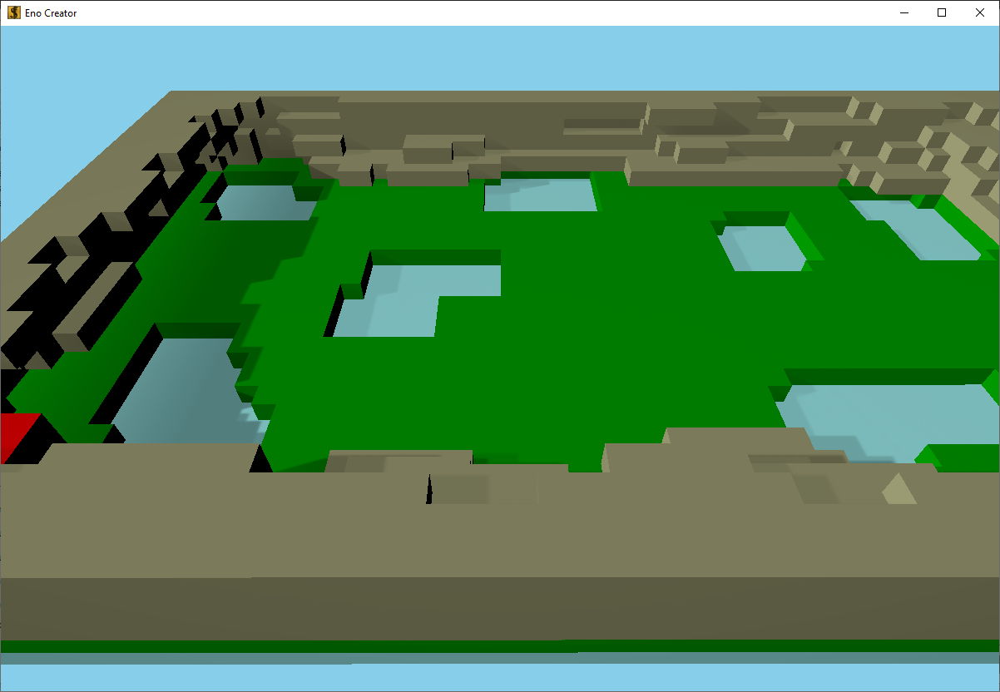

# Eno Suite

## About

Map editor, wavefront object export
You can easily create something with this application, it might look like Minecraft in a way.
And you can export your work into Wavefront file.

Eno features:
- version
- project
- tags
- textures
- materials
- bounding box
- object

Wavefront features:
- vertex / triangle
- diffuse color
- diffuse map
- opacity (dissolve)
- opacity (dissolve) map

## History

The project started in 2011, it was primarily a presentation software.
Even if now it could be used to make old school video games.
So the interface could look old.

## Units

Meter: Eno files, Wavefront files
Centimeter: Qt Quick 3D

## Requirements

- CMake 3.27+
- C++ 17
- Qt Widgets/Quick 6

## Supported platforms

- Eno: All
- Creator: Windows, Linux, macOS(maybe)
- Viewer: Windows, Linux, macOS(maybe), Android

Note about iOS: Without device, we can't update code

## Compilation

- cmake -B build
- cmake --build build

If you need to specify Qt location, add this to the first call of CMake: -D "CMAKE_PREFIX_PATH=Path to Qt"